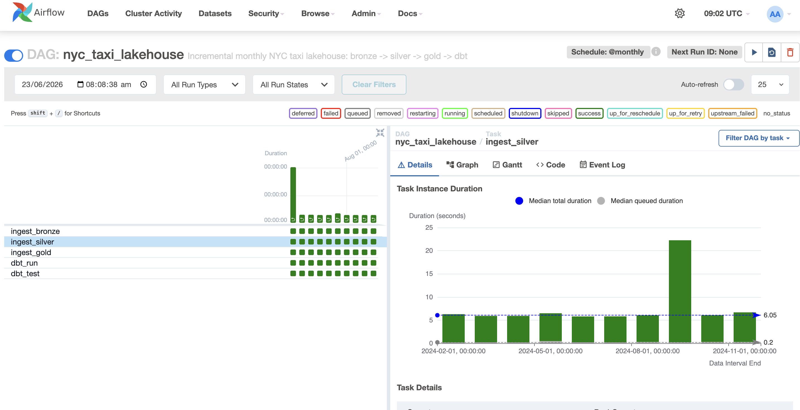

A data lakehouse built on Apache Iceberg, processing real NYC taxi trip data through bronze, silver and gold layers, with dbt and Looker Studio on top.

## Project Overview

This project ingests real NYC Yellow Taxi trip data from January 1st until October 31st. It contains approximately 33.8 million trips which they reduce down to around 29.3M after cleaning. It's loaded month by month and processes it through a medallion architecture using Apache Iceberg on Google Cloud Storage. 
Raw data lands in a bronze layer, gets cleaned and enriched in silver, then aggregated into business ready gold tables. BigQuery reads the gold layer as native Iceberg external tables, and dbt builds a staging and marts layer on top with tests and full lineage documentation. A Looker Studio dashboard visualises trip demand, revenue, and vendor activity.

Loading is incremental and idempotent. The pipeline works a month at a time, appending each new month as a fresh Iceberg snapshot and safely skipping months already loaded and the whole flow is orchestrated by Apache Airflow on a monthly schedule running in Docker.

### Stack

| Component | Tool | Notes |
|---|---|---|
| Source data | NYC TLC Yellow Taxi Trips | Monthly parquet files |
| Table format | Apache Iceberg | ACID transactions, schema enforcement, snapshot history |
| Processing | PyArrow, PyIceberg, DuckDB | Incremental, bronze/silver/gold scripts |
| Storage | Google Cloud Storage | Iceberg tables stored as managed GCS objects |
| Orchestration | Apache Airflow Docker | Monthly DAG driving bronze → silver → gold → dbt |
| Analytics | BigQuery Iceberg external tables | Queries Iceberg metadata directly |
| Transformations | dbt | Staging and mart models with tests and lineage docs |
| Visualisation | Looker Studio | Trip demand, revenue and vendor activity |

## Project Implementation

### Bronze Layer
The month's source Parquet is read and appended to the Iceberg table exactly as received, each month becomes a new snapshot rather than overwriting the table. Two metadata columns are added which are _source_file and _ingested_at. 
Therefore, every row can be traced back to its origin and ingestion time. The column _source_file is what makes the load idempotent.

### Silver Layer
Only the new month's rows are read from bronze, then cleaned and standardised before being appended to the silver table. Invalid trips are filtered out such as zero or negative fares, zero distance, zero passengers, distance and fare outliers, and trips whose pickup timestamp falls outside the file's own month.

### Gold Layer
As the aggregates are global, the gold tables are recomputed from the full silver layer and overwritten in place on each run — correct by construction and idempotent, while still recording a new Iceberg snapshot. 
Each aggregate runs as a streaming DuckDB `GROUP BY` over the silver layer, so memory stays bounded even as the data grows to tens of millions of rows. Four business ready aggregation tables are built:
- `trips_by_hour` — demand and average fare by hour of day
- `trips_by_payment` — revenue and tipping behaviour by payment method
- `vendor_summary` — trip volume and fare comparison between vendors
- `daily_summary` — daily trip volume and revenue trends

### Transformations
A dbt project sits on top of the four gold tables, exposed to BigQuery as Iceberg external tables. Staging models clean and filter the data further, and mart models add business logic such as time period categorisation and day over day deltas.


## Prerequisites

- Python 3.9+
- A [GCP account](https://cloud.google.com) with billing enabled (free tier sufficient), a GCS bucket for the warehouse, and gcloud Application Default Credentials: `gcloud auth application default login`
- [Docker](https://docs.docker.com/get-docker/) + Docker Compose (only for the Airflow path; the image build needs ~3–5 GiB of free disk)
- Python packages (the [NYC TLC trip data](https://www.nyc.gov/site/tlc/about/tlc-trip-record-data.page) is auto-downloaded per month, so no manual download is needed):

```bash
pip install -r requirements.txt
```


## Execution

### Run manually, one month at a time

```bash
# Bronze
python scripts/ingest_bronze.py 

# Silver
python scripts/ingest_silver.py 

# Gold
python scripts/ingest_gold.py

# Load the next month
python scripts/ingest_bronze.py
python scripts/ingest_silver.py
python scripts/ingest_gold.py

# dbt transformations on top of the gold layer
cd dbt_nyc_taxi
dbt run
dbt test
dbt docs generate
dbt docs serve
```

### Run with Airflow (Docker)

The Airflow stack runs the same scripts on a monthly schedule — each DAG run loads
one month (derived from its logical date), so backfilling the DAG loads the months
incrementally, one snapshot at a time.

```bash
cp .env.example .env          
docker compose build
docker compose up -d
```

## Project Structure

```
lakehouse-project/
├── data/
│   └── raw/
│       └── yellow_tripdata_2024-01.parquet   
├── scripts/
│   ├── lakehouse_common.py   
│   ├── ingest_bronze.py      
│   ├── ingest_silver.py      
│   ├── ingest_gold.py        
│   └── iceberg_time_travel.py
├── airflow/
│   ├── Dockerfile            
│   └── dags/
│       └── nyc_taxi_lakehouse_dag.py   
├── docker-compose.yaml       
├── requirements.txt
├── .env.example
├── catalog/
│   ├── iceberg_catalog.yaml 
│   └── iceberg_catalog.db  
├── dbt_nyc_taxi/
│   ├── dbt_project.yml
│   ├── models/
│   │   ├── staging/
│   │   │   ├── stg_daily_summary.sql
│   │   │   ├── stg_trips_by_hour.sql
│   │   │   ├── stg_trips_by_payment.sql
│   │   │   ├── stg_vendor_summary.sql
│   │   │   ├── schema.yml
│   │   │   └── sources.yml
│   │   └── marts/
│   │       ├── peak_hours.sql
│   │       ├── revenue_by_payment.sql
│   │       ├── vendor_comparison.sql
│   │       ├── weekly_trends.sql
│   │       └── schema.yml
└── screenshots/
    ├── airflow_grid.png        
    ├── gcs_layers.png          
    ├── iceberg_time_travel.png 
    ├── bigquery_results.png    
    ├── dbt_lineage.png        
    └── looker_dashboard.png
```

## Evaluation

### Airflow Orchestration

*The nyc_taxi_lakehouse DAG in Airflow's grid view. One green run per month between January and October 2024, each chaining ingest_bronze → ingest_silver → ingest_gold → dbt_run → dbt_test. The monthly schedule with catchup is what drives the incremental load.*

### GCS Iceberg Layers

*Bronze, silver and gold Iceberg tables stored in GCS, each with its own data/ and metadata/ folder confirming proper Iceberg table structure*

### BigQuery Results

*daily_summary gold table queried in BigQuery, recognised with the Lakehouse badge confirming native Iceberg support*

### dbt Lineage Graph

*Full lineage across all four pipelines, gold source tables → staging → marts*

### Looker Studio Dashboard

*NYC Taxi Lakehouse dashboard showing taxi demand by hour, revenue share by payment method, trip volume by vendor, and daily trip trends across January–October 2024.*

## Future Work

- **Failure alerting** — wire the DAG up to email notifications on task failure
- **Schema evolution** — show Iceberg handling a new column added to a future data load without breaking existing queries
- **Snapshot expiry / compaction** — add maintenance to expire old snapshots and compact small files as months accumulate
- **True incremental gold** — merge per key aggregates instead of recomputing from full silver, for when silver grows beyond a single machine recompute

## Conclusion

This project demonstrates a governed data lakehouse built on Apache Iceberg, processing real NYC taxi trip data through a bronze, silver and gold medallion architecture. Unlike a simple file based pipeline, every layer is a proper Iceberg table with schema enforcement and snapshot history, queryable directly from BigQuery without data duplication.

The combination of layered data quality, dbt transformations with tests and documentation, and a clear separation between raw, cleaned and business ready data reflects how analytics engineering teams structure modern data platforms.