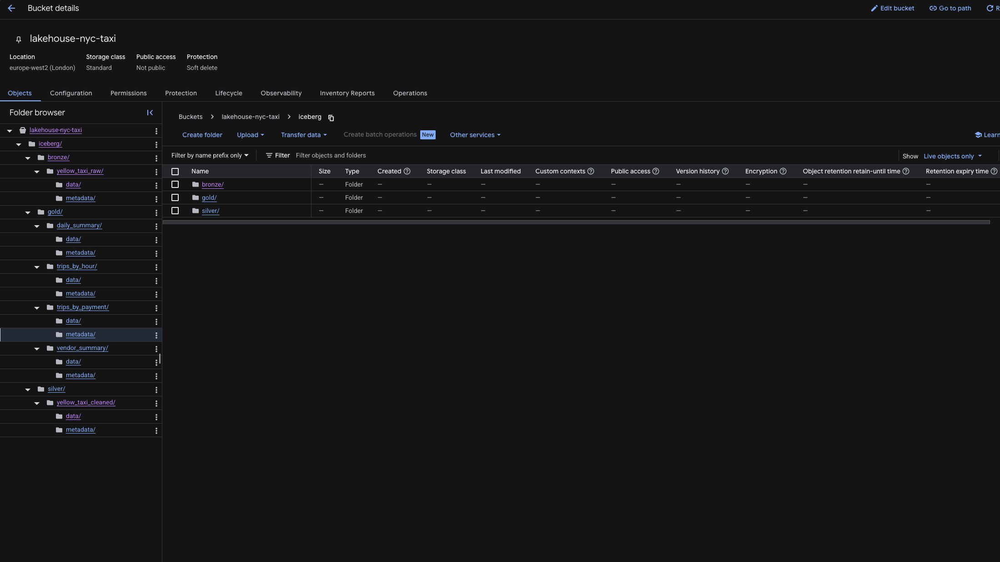
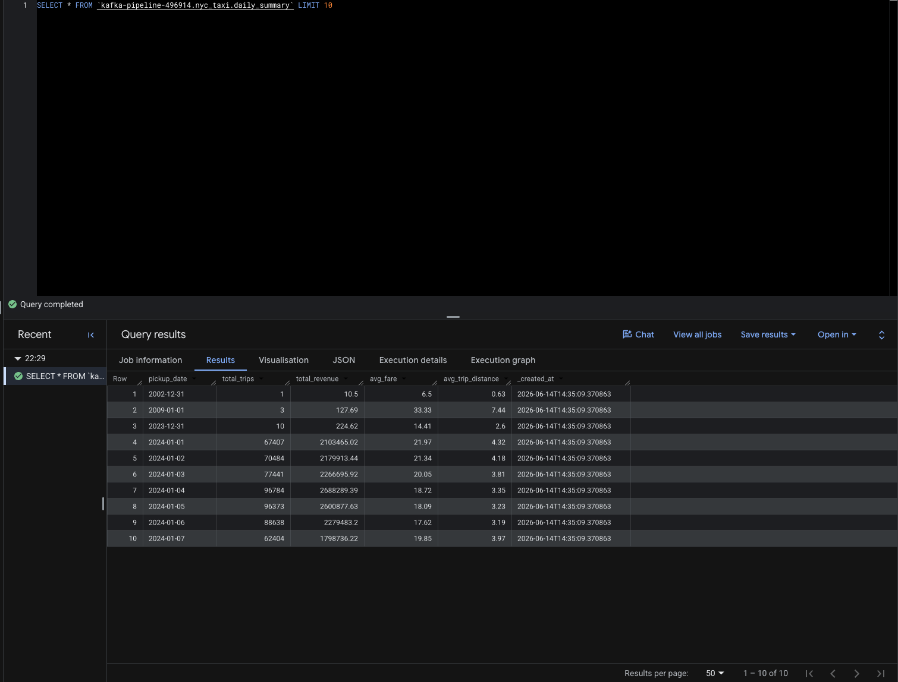
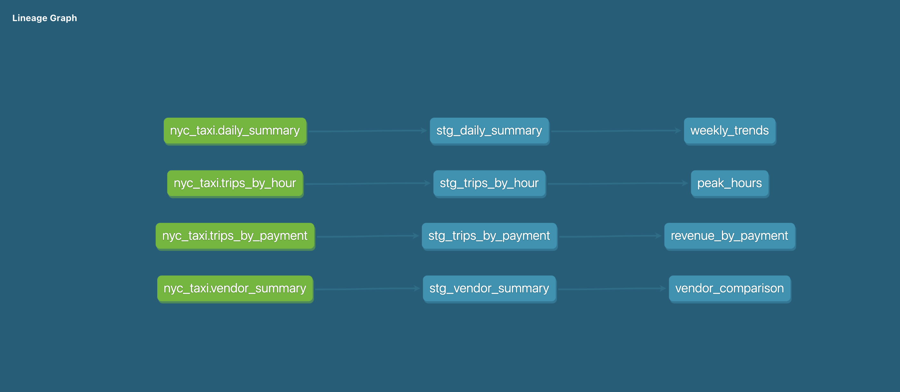
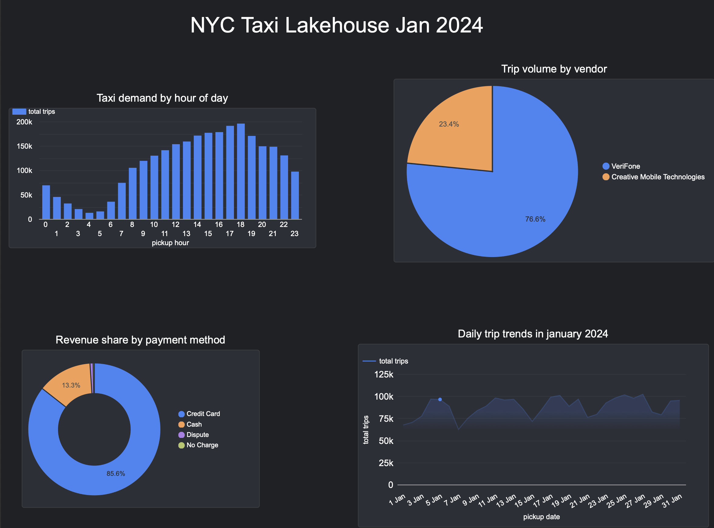

A data lakehouse built on Apache Iceberg, processing real NYC taxi trip data through bronze, silver and gold layers, with dbt and Looker Studio on top.

## Project Overview

This project ingests real NYC Yellow Taxi trip data from January 2024 (2.96 million trips) and processes it through a medallion architecture using Apache Iceberg on Google Cloud Storage. Raw data lands in a bronze layer, gets cleaned and enriched in silver, then aggregated into business ready gold tables. BigQuery reads the gold layer as native Iceberg external tables, and dbt builds a staging and marts layer on top with tests and full lineage documentation. A Looker Studio dashboard visualises trip demand, revenue, and vendor activity.

### Stack

| Component | Tool | Notes |
|---|---|---|
| Source data | NYC TLC Yellow Taxi Trips | 2.96 million trips, January 2024 |
| Table format | Apache Iceberg | ACID transactions, schema enforcement, snapshot history |
| Processing | Python (PyArrow, PyIceberg) | Bronze, silver and gold ingestion scripts |
| Storage | Google Cloud Storage | Iceberg tables stored as managed GCS objects |
| Analytics | BigQuery (Iceberg external tables) | Queries Iceberg metadata directly, no data duplication |
| Transformations | dbt (BigQuery adapter) | Staging and mart models with tests and lineage docs |
| Visualisation | Looker Studio | Trip demand, revenue and vendor activity |

## Project Implementation

### Bronze Layer
Raw NYC Yellow Taxi trip data is read from a source Parquet file and written to an Iceberg table exactly as received. Two metadata columns are added (`_source_file`, `_ingested_at`) so every row can be traced back to its origin and ingestion time.

### Silver Layer
The bronze table is cleaned and standardised. Invalid trips are filtered out (zero or negative fares, zero distance, zero passengers, distance and fare outliers). Calculated columns are added (`trip_duration_minutes`, `pickup_hour`, `pickup_day_of_week`), and `payment_type` and `VendorID` are decoded from raw integer codes into readable labels.

### Gold Layer
Four business ready aggregation tables are built from the silver layer:
- `trips_by_hour` — demand and average fare by hour of day
- `trips_by_payment` — revenue and tipping behaviour by payment method
- `vendor_summary` — trip volume and fare comparison between vendors
- `daily_summary` — daily trip volume and revenue trends across January

### Transformations
A dbt project sits on top of the four gold tables, exposed to BigQuery as Iceberg external tables. Staging models clean and filter the data further, and mart models (`peak_hours`, `revenue_by_payment`, `vendor_comparison`, `weekly_trends`) add business logic such as time period categorisation and day over day deltas.


## Prerequisites

- Python 3.8+
- A [GCP account](https://cloud.google.com) with billing enabled (free tier sufficient)
- The [NYC TLC Yellow Taxi trip data](https://www.nyc.gov/site/tlc/about/tlc-trip-record-data.page) for January 2024
- The following Python packages:

```bash
pip install 'pyiceberg[gcs,sql-sqlite,pyarrow]' duckdb pandas pyarrow dbt-bigquery
```


## Execution

```bash
# Ingest bronze layer
python scripts/ingest_bronze.py

# Clean and transform into silver layer
python scripts/ingest_silver.py

# Build gold aggregation tables
python scripts/ingest_gold.py

# Run dbt transformations
cd dbt_nyc_taxi
dbt run
dbt test
dbt docs generate
dbt docs serve
```

## Project Structure

```
lakehouse-project/
├── data/
│   └── raw/
│       └── yellow_tripdata_2024-01.parquet   
├── scripts/
│   ├── ingest_bronze.py     
│   ├── ingest_silver.py     
│   └── ingest_gold.py       
├── catalog/
│   ├── iceberg_catalog.yaml 
│   └── iceberg_catalog.db  
├── dbt_nyc_taxi/
│   ├── dbt_project.yml
│   ├── models/
│   │   ├── staging/
│   │   │   ├── stg_daily_summary.sql
│   │   │   ├── stg_trips_by_hour.sql
│   │   │   ├── stg_trips_by_payment.sql
│   │   │   ├── stg_vendor_summary.sql
│   │   │   ├── schema.yml
│   │   │   └── sources.yml
│   │   └── marts/
│   │       ├── peak_hours.sql
│   │       ├── revenue_by_payment.sql
│   │       ├── vendor_comparison.sql
│   │       ├── weekly_trends.sql
│   │       └── schema.yml
└── screenshots/
    ├── gcs_layers.png          
    ├── iceberg_time_travel.png 
    ├── bigquery_results.png    
    ├── dbt_lineage.png        
    └── looker_dashboard.png
```

## Evaluation

### GCS Iceberg Layers

*Bronze, silver and gold Iceberg tables stored in GCS, each with its own data/ and metadata/ folder confirming proper Iceberg table structure*

### BigQuery Results

*daily_summary gold table queried in BigQuery, recognised with the Lakehouse badge confirming native Iceberg support*

### dbt Lineage Graph

*Full lineage across all four pipelines, gold source tables → staging → marts*

### Looker Studio Dashboard

*NYC Taxi Lakehouse dashboard showing taxi demand by hour, revenue share by payment method, trip volume by vendor, and daily trip trends across January 2024*

## Future Work

- **Incremental loading** — currently each run overwrites the bronze table entirely; a production version would append new data incrementally as new files arrive
- **Airflow orchestration** — chain bronze, silver, gold and dbt runs into a single scheduled DAG with failure alerting
- **Time travel** — demonstrate querying historical Iceberg snapshots, one of Iceberg's core features not yet used in this project
- **Schema evolution** — show Iceberg handling a new column added to a future data load without breaking existing queries
- **Multi-month data** — extend beyond January 2024 to show trends across a longer time period

## Conclusion

This project demonstrates a governed data lakehouse built on Apache Iceberg, processing real NYC taxi trip data through a bronze, silver and gold medallion architecture. Unlike a simple file based pipeline, every layer is a proper Iceberg table with schema enforcement and snapshot history, queryable directly from BigQuery without data duplication.

The combination of layered data quality, dbt transformations with tests and documentation, and a clear separation between raw, cleaned and business ready data reflects how analytics engineering teams structure modern data platforms.